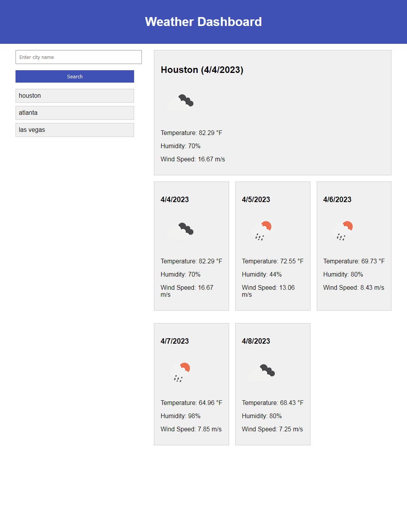
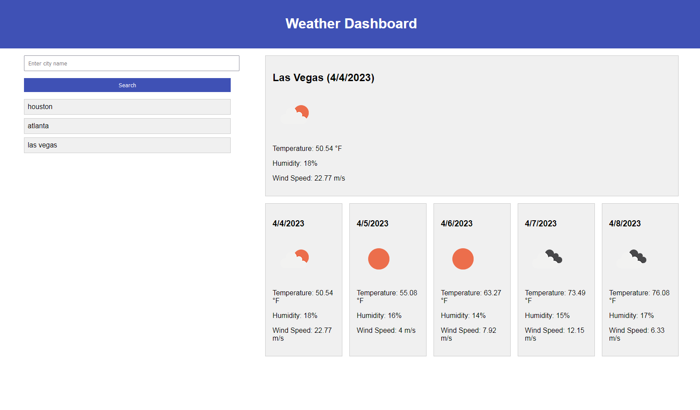

# Dashboard-Weather

## Description
This is a 5-day weather forecast dashboard that uses the OpenWeather API in order to fetch temperature, humidity, and wind speed data from cities across the globe. Simply use the search bar to lookup a city and a 5-day forecast will populate. Your recent searches will be displayed below the search bar for convenience. The images below display all these functionalities working.

## Table of Contents
- [Description](#description)
- [Preview](#preview)
- [Author](#author)
- [License](#license)

## Preview
Link to website: [CLICK ME](https://jo3kr.github.io/Dashboard-Weather/)

## Author
Joel John
- [GitHub](https://github.com/jo3kr)
## License
 MIT License

Copyright &copy; 2022 jo3kr &#127183;